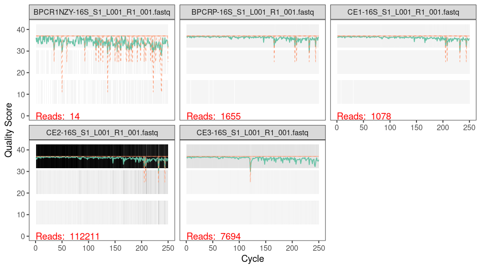
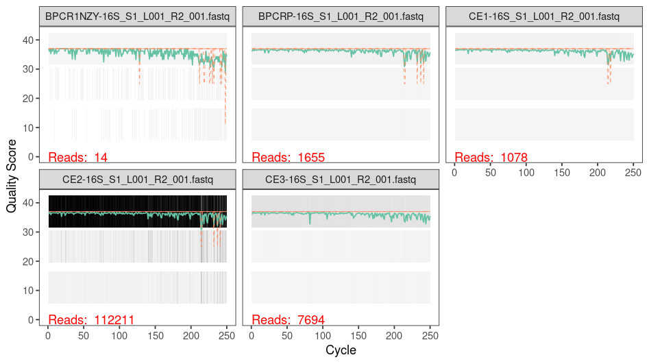
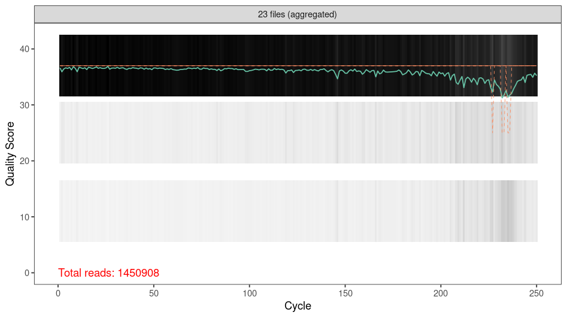
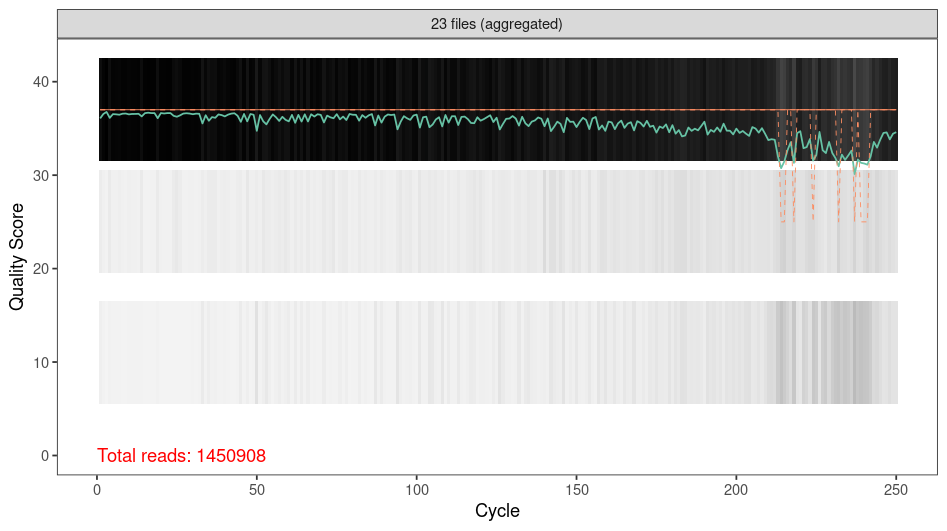
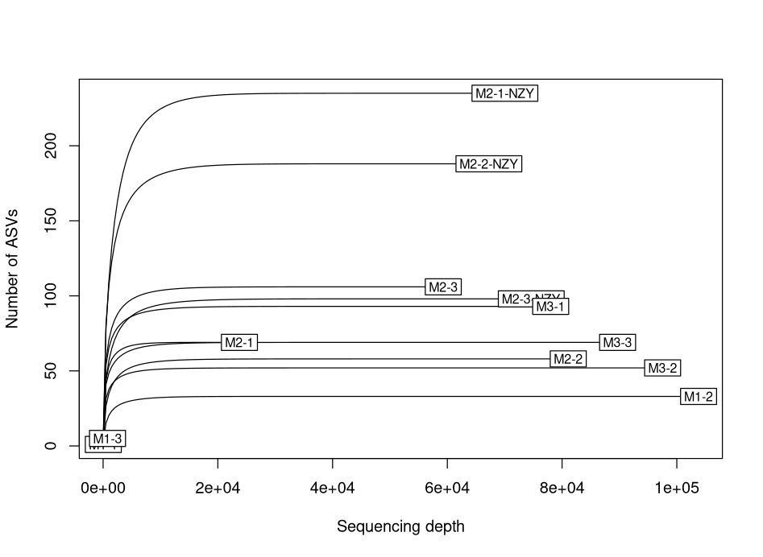
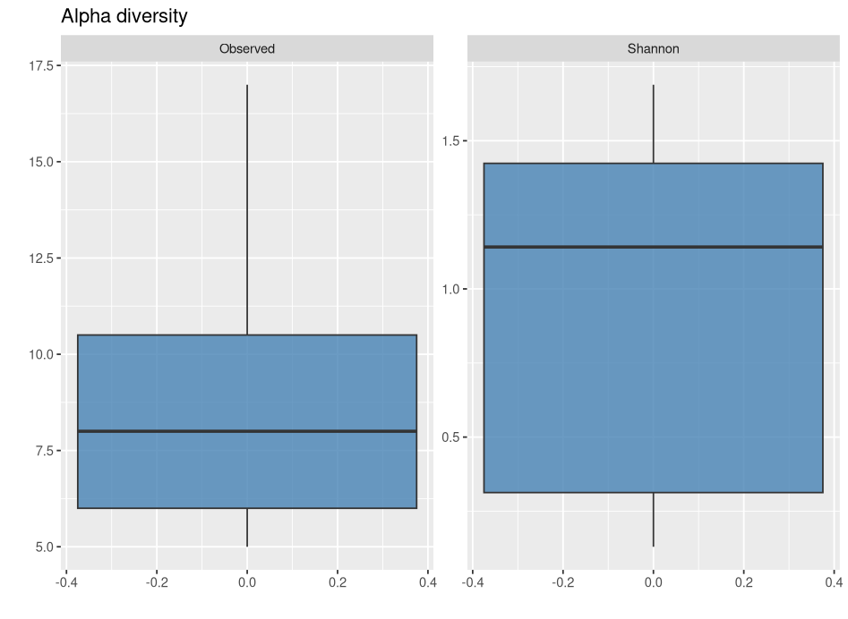

<!-- badges: start -->

[](http://perso.crans.org/besson/LICENSE.html)
[](https://lifecycle.r-lib.org/articles/stages.html#experimental)

<!-- badges: end -->

# Introduction

# Preliminary steps

Before starting, we advise the user to create a dedicated directory
(folder) to the project. Within this directory, the user may add
additional directories:

-   R (for R scripts)
-   input (for input files, like fastq)
-   results (to store results)

Note: be careful to know the paths to the files you will be using later
on.

## Verify sequencig quality

To verify the quality of the sequencing results, there are several tools
available.

We recommend using either FASTQC (Andrews, 2010) or MultiQC (Ewels,
2016).

-   FASTQC: <https://www.bioinformatics.babraham.ac.uk/projects/fastqc/>
-   MultiQC: <https://seqera.io/multiqc/>

## Pre-processing of FASTQ files

If the FASTQ files include adaptor sequences and/or primers, it is
possible to remove them using cutadapt, for example.

-   cutadapt: <https://cutadapt.readthedocs.io/en/stable/>

Primer removal is also possible in the DADA2 section of code, presented
below. However, **if you remove the primers with cutadapt, then you must
not cut them again in DADA2**.

# Raw reads processing in R

Packages required for steps in R:

``` r
# Packages used
library(dada2); packageVersion("dada2") ## we used 1.22
library(ShortRead)
library(seqinr) # to make FASTA file
library(dplyr)
```

# Obtain unique sequences using DADA2

DADA2 is an R package used to assign amplicon sequence variants (ASVs)
from FASTQ files (Callahan et al., 2016).

## Data preparation

The first few steps will ensure that DADA2 knows where the FASTQ files
are stored and what they refer to. Note that you will need to change the
path according to your own files.

``` r
path <- "./path_to_directory" # CHANGE ME to the directory containing the fastq files after unzipping.
# verify files in path
list.files(path)

# Forward and reverse fastq file names have format: SAMPLENAME_R1_001.fastq and SAMPLENAME_R2_001.fastq
# CHANGE according to your file names
# note: fastq.gz files usually don't need to be decompressed for this step
fnFs <- sort(list.files(path, pattern="_R1_001.fastq", full.names = TRUE))
fnFs
fnRs <- sort(list.files(path, pattern="_R2_001.fastq", full.names = TRUE))
fnRs

# Extract sample names, assuming filenames have format: SAMPLENAME_XXX.fastq
sample.namesF <- sapply(strsplit(basename(fnFs), "[.]"), `[`, 1)
sample.namesF
sample.namesR <- sapply(strsplit(basename(fnRs), "[.]"), `[`, 1)
sample.namesR

# Place filtered files in filtered/ subdirectory
filtFs <- file.path(path, "filtered", paste0(sample.namesF, "_F_filt.fastq.gz"))
filtRs <- file.path(path, "filtered", paste0(sample.namesR, "_R_filt.fastq.gz"))
names(filtFs) <- sample.namesF
names(filtRs) <- sample.namesR
```

## Quality profiles

Inspect quality of sequencing.

``` r
# Example for 5 samples
# Quality of forward reads
plotQualityProfile(fnFs[1:5])
# Quality of reverse reads
plotQualityProfile(fnRs[1:5])
```

<figure>

<figcaption aria-hidden="true">Quality profiles of forward reads - 5
files</figcaption>
</figure>

<figure>

<figcaption aria-hidden="true">Quality profiles of reverse reads - 5
files</figcaption>
</figure>

``` r
# To inspect many samples at once
plotQualityProfile(fnFs, aggregate = TRUE)
plotQualityProfile(fnRs, aggregate = TRUE)
```

<figure>

<figcaption aria-hidden="true">Aggregate quality plot example for
forward reads</figcaption>
</figure>

<figure>

<figcaption aria-hidden="true">Aggregate quality plot example for
reverse reads</figcaption>
</figure>

Note: You can save the plot in the results, for example, for later use.

## Filter and trim reads

Based on quality profiles, decide the trimming parameters. Specifically,
*truncLen* is used to trim reads by removing nucleotides at the end of
the reads. In *truncLen*, the first value corresponds to the trimming of
the forward reads and the second is for the reverse reads. While
deciding the trimming, take into account the expected read length of
forward and reverse reads, which need, at least, 12 bp to merge at a
later step. For more details on DADA2 parameters see:
<https://benjjneb.github.io/dada2/tutorial.html>

If the primers are present in your samples and you are sure that they
are right at the beginning of the sequence, then you can use *trimLeft*
to remove them.

All other parameters are set to default.

**Note:** If you are using a Windows OS, set multithread to FALSE.

``` r
out <- filterAndTrim(fnFs, filtFs, fnRs, filtRs, 
                     truncLen=c(240,210), ## change according to quality profiles 
                     maxN=0, maxEE=c(2,2), truncQ=2, rm.phix=TRUE, 
                     compress=TRUE, multithread = TRUE,# On Windows set multithread=FALSE
                     ## OPTIONAL: if you need to remove primers at this stage, you can use trimLeft
                     #trimLeft = c(nchar("AGACGAGAAGACCCTATG"),                      
                     #            nchar("GGATTGCGCTGTTATCCC"))
                     ) 
```

## Learn error rates

To distinguish true sequence variations from sequencing errors, DADA2
calculates the probability of finding an error, given the error
distribution. So, the next step is to learn the error rates:

**Note:** This step might take a while. Again, set multithread to FALSE,
if using Windows OS.

``` r
#Learn the Error Rates
errF <- learnErrors(filtFs, multithread=FALSE)
errR <- learnErrors(filtRs, multithread=FALSE)
```

After learning the error rates, it is possible to do a sanity check on
the model:

``` r
plotErrors(errF, nominalQ=TRUE)
plotErrors(errR, nominalQ=TRUE)
```

## Dereplication and inference of ASVs

To reduce computational effort, the user may add a dereplication step:

``` r
derepFs <- derepFastq(filtFs, verbose = TRUE)
names(derepFs) <- sample.names
derepRs <- derepFastq(filtRs, verbose = TRUE)
names(derepRs) <- sample.names
```

Based on error rates model, DADA will identify unique sequences:

``` r
# Identify unique sequences
dadaFs <- dada(derepFs, err=errF, multithread=TRUE)
dadaRs <- dada(derepRs, err=errR, multithread=TRUE)
```

Next, DADA2 will merge the forward and reverse reads. If after this step
you lost a significant amount of reads, check the trimming parameters
(see *Filter and trim reads section*). Consider that you need at least
12 bp of merge between forward and reverse reads (by default). We do not
recommend changing the default overlap.

``` r
#Merge paired reads
mergers <- mergePairs(dadaFs, filtFs, dadaRs, filtRs, verbose=TRUE)
```

Construct an abundance table:

``` r
#Construct sequence table
seqtab <- makeSequenceTable(mergers)
```

Verify length of reads:

``` r
table(nchar(getSequences(seqtab)))
hist(nchar(getSequences(seqtab)), main = "Distribution of Sequence lengths")
```

## Remove chimeric sequences

To remove chimeric sequences:

``` r
#Remove chimeras
seqtab.nochim <- removeBimeraDenovo(seqtab, method="consensus", multithread=TRUE, verbose=TRUE)

# check percentage of non-chimeric sequences
sum(seqtab.nochim)/sum(seqtab)
```

## Summary track reads

Then we can track the number of reads after each step:

``` r
#Track reads through the pipeline
getN <- function(x) sum(getUniques(x))
track <- cbind(out, sapply(dadaFs, getN), sapply(dadaRs, getN), sapply(mergers, getN), rowSums(seqtab.nochim))

# If processing a single sample, remove the sapply calls: e.g. replace sapply(dadaFs, getN) with getN(dadaFs)
colnames(track) <- c("input", "filtered", "denoisedF", "denoisedR", "merged", "nonchim")
rownames(track) <- sample.namesF ## sample.namesF is just to indicate the sample ID
head(track)
```

## Save ASV table

At this stage, you can save the ASV table for later use:

``` r
# Change object name
ASV_table <- seqtab.nochim

# Create .csv file
write.table(seqtab.nochim, file='./results/ASV_table.tsv', quote=FALSE, sep='\t', col.names = NA)
```

## Export reads to a FASTA file

Generally, it is useful to have the final unique sequences in a FASTA
file. We are going to use this file later for BLASTN.

In this step, it is important to keep track of the position of the ASVs,
so that we can connect the taxonomy obtained with NCBI and the abundance
table.

``` r
# load ASV table
#ASV_table <- read.table("./ASV_table.tsv") ## optional: to load the abundance table previously made

# make data frame with unique ASVs ID and Sequence
ASVs.df <- ASV_table %>% 
    colnames() %>% 
    as.data.frame() %>% 
    rename(Sequence = ".") %>% 
    distinct() %>% 
  mutate(ASV = paste0("ASV_", row_number(.)))

# Make FASTA file 
write.fasta(sequences = as.list(ASVs.df$Sequence), 
            names = ASVs.df$ASV, 
            "./ASV.fasta",
            as.string = TRUE)
```

# Assign taxonomy

To assign taxonomy, we follow these steps:

1.  BLASTN against the nucleotide (nt) database from NCBI
    (<https://ftp.ncbi.nlm.nih.gov/blast/db/>).
2.  Filter the best hits based on multiple parameters (see below).
3.  Solve ties within genus and family level (Lowest Common Ancestor
    approach).

## Run BLASTN against NCBI

To run blastn (Camacha et al., 2009; Altschul et al., 1990) against the
nucleotide database of NCBI (Benson et al., 2013), we use the **BLAST
Command Line Tool**.

Please see installation instructions at:
<https://www.ncbi.nlm.nih.gov/books/NBK569861/>

Blast parameters: - Minimum percentage identity: 99.0% - Maximum evalue:
10⁻⁵ - Minimum query cover: 80%

**Note**: Don’t forget to change the path and file names.

``` bash
blastn -db nt -query ./results/ASV.fasta -out blast_results -outfmt "6 delim=, qacc qlen sseqid sacc slen evalue bitscore score length pident nident mismatch positive gaps staxid ssciname sblastname scomnames skingdoms" -evalue 1e-05 -perc_identity 99 -qcov_hsp_perc 80 -remote
```

This command returns a table named blast_results (you can change the
name as needed). The parameter *-outfmt* determines the format and
variables present in the table.

The parameter *-remote* runs the code in the NCBI dedicated server,
which means that the time it takes to run your samples might vary.

**Note:** change the file paths as needed.

## Assign taxonomy based on best hits

For this section we will need additional pacakges:

``` r
library(tidyr)
library(ulrb)
library(stringr)
library(purrr)
library(readxl)
library(worms)
```

The raw blast results include all the hits. Therefore, we need to apply
multiple filters to obtain the best hits. To do so, we go back to R.

Start by loading the blast results into your R session:

``` r
# load blast results
all_hits <- read.csv("./results/blast_results", header = FALSE, # change file path as needed
                     col.names = c("Query accession", "Query sequence length",
                                   "Subject seq-id",    "Subject accession",
                                   "Subject sequence length",   "evalue", "Bit Score",
                                   "Raw Score", "Alignment length", "Percentage of identical matches",
                                   "Number of identical matches",   "Number of mismatches",
                                   "Number of positive scoring matches", "Total number of gaps",
                                   "Taxonomy ID", "Scientific name",    "Subject blast name", 
                                   "Subject common name"))
```

## Add ban list (optional)

Considering the length of the reads used to classify taxonomy, and
considering the high similarity between some species within the same
families, it is possible to have a sequence attributed to multiple
different species. However, based on the area of study, it might be
possible to know beforehand that some species are not present in the
area. Thus, in those specific situations, to improve the accuracy of the
classification, we can remove them, using a ban list. Note that this is
optional and should be carefully considered by the user, to avoid
introducing bias in the analysis.

If you want to apply a ban list, you must edit the file
**ban_list.txt**, according to your own experimental setup. If you have
no prior knowledge of the species expected in the area, then you should
**not** aply this step.

``` r
# ban list
ban_list <- read.table("./refs/ban_list.txt", header = FALSE) %>% 
  rename(Genus = V1,
         Species = V2) %>% 
  mutate(binomial_name = paste(Genus, Species)) %>% 
  pull(binomial_name)
```

## Prevent match with non-16S genes

Additionally, we also need to ensure that we are not obtaining matches
from non-16S genes. To do so, we filter all accessions based on a
reference file with all possible target gene accessions.

``` r
# target genes
target_genes <- read.table("refs/gene_16_list.txt", header = FALSE) ## last accessed 23 May 2025
# some data cleaning
target_genes <- target_genes %>% 
  rename(Subject.accession = V1) %>% 
  mutate(Subject.accession = str_remove(Subject.accession, "\\.\\d+"))
```

Filter relevant hits:

-   Minimum alignment length: 190 nt
-   Remove species in ban list;
-   Remove hits from non-target genes:
-   Keep hits from relevant biological groups (teleosts, cetaceans, and
    elasmobranchs)

``` r
# Filer valid hits
filtered_hits <- all_hits %>%
  filter(Alignment.length >= 190,
        !Scientific.name %in% ban_list,
         Subject.accession %in% target_genes$Subject.accession,
         Subject.blast.name %in% c("bony fishes",
                                   "whales & dolphins",
                                   "sharks & rays"))
```

After filtration, we have multiple hits for each ASV. To obtain the best
hit, we select the hits with highest bit score and percentage identity:

``` r
# Obtain top hits and remove environmental samples hits before summarizing
top_hits <- filtered_hits %>%
    # Remove environmental sample rows
  filter(!grepl("environmental sample", Scientific.name, ignore.case = TRUE)) %>%
  # Normalize to first two words for species-level matching
  mutate(Scientific.name = sub("^([A-Za-z]+\\s+[A-Za-z]+).*", "\\1", Scientific.name)) %>%
  group_by(Query.accession) %>%
  filter(Bit.Score == max(Bit.Score)) %>%
  filter(Percentage.of.identical.matches == max(Percentage.of.identical.matches)) %>% 
  ungroup()
```

## Obtain full taxonomy for all identified species

``` r
# Get all species
all_species <- top_hits$Scientific.name %>% unique()

# make data frame with full taxonomy of species
# may take a while
all_species_info <- map(.x = all_species, .f = ~wormsbymatchnames(.x)) %>% 
  bind_rows() %>% 
  select(kingdom, phylum, class, order, family, genus)
```

Merge taxonomic information to blast hits:

``` r
# Merge taxonomic information to blast hits
top_hits_with_taxa_info <- top_hits %>% 
  left_join(all_species_info, by = c("Scientific.name" = "scientificname"))
```

It is possible to obtain multiple hits with the same scores, but
different species. Usually, within the same genus or within the same
family. We call these situations *ties*.

To solve ties we need the following functions:

-   check_ties; *identifies ties that need to be solved*
-   assign_LCA. *breaks the tie by identifying the lowest common
    ancestor - LCA*

``` r
# check ties function
check_ties <- function(x){
  x %>%
    pull(Scientific.name) %>% 
    unique() %>% 
    word() %>%
    unique() 
} 
```

``` r
# assign_LCA function
assign_LCA <- function(x){
  # make possible LCAs
  # no family ties, assign family as LCA
  fam_LCA <- x %>% 
    pull(family) %>% 
    unique()
  genus_LCA <- x %>% 
    pull(genus) %>% 
    unique()
  species_LCA <- x %>% 
    pull(Scientific.name) %>% 
    unique()
  
  #
  if(length(fam_LCA) > 1){
    LCA <- "Uncertain"
  } else if(length(genus_LCA) > 1){
    LCA <- fam_LCA
  } else if(length(species_LCA) > 1){
    LCA <- genus_LCA
  } else {
    LCA <- species_LCA
  }
  return(LCA)
}
```

**Note on assign_LCA():** - For species tied within the same genus, we
can always assign LCA - it is the genus sp. - Likewise, we can break
ties up to family level (that is, assign LCA up to order level). - Note:
if genera from different orders are tied, we assign to **Uncertain**.

Get best hits, without ties:

``` r
# best hits, with LCA
taxonomic_assignments <- top_hits_with_taxa_info %>%
  group_by(Query.accession) %>% 
  nest() %>% 
  mutate(LCA = map(.x = data, 
                   .f = ~assign_LCA(.x))) %>% 
  mutate(taxa = map(.x = data, .f = ~unique(.x$Scientific.name))) %>% 
  mutate(isTie = map(.x = taxa, .f = ~ifelse(length(unique(.x)) == 1, FALSE, TRUE))) %>% 
  unnest(c(LCA, data, isTie)) %>% 
  group_by(Query.accession) %>% 
  slice_head(n = 1) %>% 
  mutate(FinalAssignment = ifelse(isTRUE(isTie), LCA, Scientific.name)) %>% 
  select(Query.accession,
         Scientific.name, 
         LCA, FinalAssignment, 
         Bit.Score, evalue, Alignment.length,
         Percentage.of.identical.matches,
         Number.of.identical.matches,
         Number.of.mismatches)

# view results in your R session
View(taxonomic_assignments)

# Save final assignments into memory
write.csv(taxonomic_assignments, "taxonomic_assignments.csv")
```

## Add taxonomic assignments to ASV abundance table

First, we need to transform the blast results in a data frame compatible
with the abundance table. Then, we can merge them based on ASV ID.

``` r
# transform blast results to compatible format
ASV_ncbi <- taxonomic_assignments %>% 
  select(ASV = Query.accession, Scientific.name) %>% 
  filter(!is.na(Scientific.name)) %>%  # Remove unassigned ASVs
  left_join(ASVs.df, by = "ASV") # ASVs.df was made in the DADA2 section

# Create abundance table in long format
abundance_table_long <- ASV_table %>% # ASV_table was made in DADA2 section
  prepare_tidy_data(sample_names = row.names(ASV_table), samples_in = "rows") %>% 
  rename(Sequence = Taxa_id) %>% 
  left_join(ASVs.df, by = "Sequence") %>% 
  left_join(ASV_ncbi, by = "ASV")

# Creates abundance table in wide format
abundance_table_wide <- abundance_table_long %>% 
  pivot_wider(names_from = Sample, values_from = Abundance)

# sabe wide format abundance table
write.csv(abundance_table_wide, "results/abundance_table_wide.csv")
```

## Extras

After the abundance table is ready, we can add additional steps, like
the removal of ASVs below 0.01% relative abundance.

``` r
# Filter local low abundance (< 0.01%)
abundance_table_long_filtered <- abundance_table_long %>% 
  group_by(Sample) %>% 
  mutate(relativeAbundance = Abundance*100/sum(Abundance)) %>% 
  mutate(Abundance = ifelse(relativeAbundance > 0.01, Abundance, 0),
         Abundance = ifelse(is.na(Abundance), 0, Abundance)) %>% 
  select(-Sequence.y, -relativeAbundance) %>% 
  rename(Sequence = Sequence.x)
```

**Identify ASVs from control samples and filter them out**

Before this step, fill the **sample_control_map_template.xlsx** file in
**refs** folder, you can follow the example file,
**sample_control_map_example.xlsx**.

``` r
# Load sample_control_map
sample_control_map_df <- readxl::read_xlsx("refs/sample_control_map_example_complete.xlsx")

# convert to long format 
sample_control_map_long <- sample_control_map_df %>% 
  pivot_longer(cols = c("Extraction_control", 
                        "Filtration_control", 
                        "PCR_control"),
               values_to = "Control_ID",
               names_to = "Control_type")

# Load function to remove contamination, based on control map
source("./R/remove_contamination.R")

# store sample names in a vector
sample_names <- sample_control_map_df$Sample_name %>% unique() 

# Remove contamination for all samples and re-merge in a single data frame
abundance_table_no_cont <- map(.x = sample_names, 
                                 .f = ~remove_contamination(data = abundance_table_long, sample = .x)) %>% 
  bind_rows()

# convert to wide format
abundance_table_no_cont_wide <- abundance_table_no_cont %>% 
  pivot_wider(names_from = Sample, values_from = Abundance)

# Save long-format abundance table
write.csv(abundance_table_no_cont, file = "results/abundance_table_long_eDNA.csv", row.names = FALSE)

# Save wide-format table
write.csv(abundance_table_no_cont_wide, file = "results/abundance_table_wide_eDNA_filtered.csv", row.names = FALSE)
```

*Note*: ASVs removed during contamination removal process are marked as
NAs in the wide format table.

# Verify results

For this section we need additional packages:

``` r
library(vegan)
library(scales)
```

We provide some examples of data analyses below.

## Rarefaction curves

``` r
# step for rarefaction curve
# remove unnecessary columns
ASV_matrix.1 <- abundance_table_no_cont_wide %>% 
  select(-Sequence, -Scientific.name) 

#
asv_col <- ASV_matrix.1$ASV
ASV_matrix.1$ASV <- NULL
rownames(ASV_matrix.1) <- asv_col

#  
ASV_matrix <- ASV_matrix.1 %>% t()

# replace NA's to 0
ASV_matrix[is.na(ASV_matrix)] <- 0

# replace sample name to shorter version
rownames(ASV_matrix) <- str_remove(rownames(ASV_matrix), "-16S_S1_L001_R1_001")

# rarefaction curve
rarecurve(ASV_matrix, 
          step = 500, 
          xlab = "Sequencing depth",
          ylab = "Number of ASVs")
```

<figure>

<figcaption aria-hidden="true">Rarefaction curve example</figcaption>
</figure>

## Example of quick diversity analysis

``` r
# (Optional) Load abundance table in wide format
#abundance_table_no_cont_wide <- read.csv("abundance_table_no_cont_wide.csv")

# Remove NAs in Scientific.name
abundance_table_no_cont_wide <- abundance_table_no_cont_wide %>% filter(!is.na(Scientific.name))

# Define and remove unwanted columns
cols_to_remove <- c("Sequence", "ASV", unique(sample_control_map_long$Control_ID))

# make a shorter table
df_clean <- abundance_table_no_cont_wide  %>% 
  select(-any_of(cols_to_remove))

# Create ASV matrix
# Ensure unique rownames (from first column, presumably ASV IDs)
rownames(df_clean) <- make.unique(as.character(df_clean[[1]]))

# Extract abundance matrix (drop first column which was used as rownames)
asv_matrix <- df_clean[, -1]

# Clean sample names by removing suffix
colnames(asv_matrix) <- gsub("-16S_S1_L001_R1_001", "", colnames(asv_matrix))

# Transpose: samples as rows, ASVs as columns
asv_matrix_t <- t(asv_matrix)

# Remove empty samples (rows with sum 0)
asv_matrix_t <- asv_matrix_t[rowSums(asv_matrix_t) > 0, ]

# Clean sample names again from filtered matrix rownames (just to be sure)
rownames(asv_matrix_t) <- gsub("-16S_S1_L001_R1_001", "", rownames(asv_matrix_t))

# Alpha Diversity per Sample (Observed + Shannon)
# Calculate diversity metrics per sample
alpha_df <- data.frame(
  Sample = rownames(asv_matrix_t),
  Observed = rowSums(asv_matrix_t > 0),
  Shannon = diversity(asv_matrix_t, index = "shannon")
)

# tidy alpha_df
alpha_tidy <- alpha_df %>% 
  pivot_longer(cols = c("Observed", "Shannon"), 
               names_to = "Metric", 
               values_to = "Score")

# Observed Richness (Boxplot only)
ggplot(alpha_tidy, aes(y = Score)) +
  geom_boxplot(fill = "steelblue", alpha = 0.8) +
  labs(title = "Alpha diversity", 
       x = "", 
       y = "") +
  facet_wrap(~Metric, scales = "free_y")
```

<figure>

<figcaption aria-hidden="true">Alpha diversity - boxplot
example</figcaption>
</figure>

``` r
# Beta Diversity (Bray-Curtis)
# Calculate Bray-Curtis dissimilarity
bray_dist <- vegdist(asv_matrix_t, method = "bray")

# Perform NMDS (k=2 dimensions)
set.seed(42); nmds_res <- metaMDS(bray_dist, k = 2, trymax = 100)

# Extract NMDS points
nmds_df <- as.data.frame(nmds_res$points)
colnames(nmds_df) <- c("NMDS1", "NMDS2")

# Add sample names
nmds_df$Sample <- rownames(asv_matrix_t)

# Print NMDS stress value
cat("NMDS stress:", round(nmds_res$stress, 4), "\n")

# Plot NMDS
ggplot(nmds_df, aes(x = NMDS1, y = NMDS2, label = Sample)) +
  geom_point(size = 3, color = "darkorange") +
  geom_text(vjust = -0.5, size = 3) +
  labs(title = paste("Beta Diversity (Bray-Curtis NMDS), Stress =", round(nmds_res$stress, 3)),
       x = "NMDS1", y = "NMDS2") +
  theme_minimal()

# Calculate Jaccard dissimilarity (presence/absence)
jaccard_dist <- vegdist(asv_matrix_t, method = "jaccard", binary = TRUE)

# NMDS on Jaccard
set.seed(42); nmds_jaccard <- metaMDS(jaccard_dist, k = 2, trymax = 100)

# Prepare dataframe
nmds_jaccard_df <- as.data.frame(nmds_jaccard$points)
colnames(nmds_jaccard_df) <- c("NMDS1", "NMDS2")
nmds_jaccard_df$Sample <- rownames(nmds_jaccard_df)

# Plot Jaccard NMDS
ggplot(nmds_jaccard_df, aes(x = NMDS1, y = NMDS2, label = Sample)) +
  geom_point(size = 3, color = "steelblue") +
  geom_text(vjust = -0.5, size = 3) +
  labs(title = paste("Beta Diversity (Jaccard NMDS), Stress =", round(nmds_jaccard$stress, 3)),
       x = "NMDS1", y = "NMDS2") +
  theme_minimal()

# Relative Abundance Plot
#Pivot data to long format
asv_long <- df_clean %>%
  pivot_longer(cols = -Scientific.name, names_to = "Sample", values_to = "Abundance")

#Clean sample names
asv_long$Sample <- gsub("-16S_S1_L001_R1_001", "", asv_long$Sample)

#Remove zero abundances
asv_long <- asv_long %>% filter(Abundance > 0)

#Calculate relative abundance per sample
asv_rel_abund <- asv_long %>%
  group_by(Sample) %>%
  mutate(RelAbund = Abundance / sum(Abundance)) %>%
  ungroup()

#Use all species directly as taxon labels
asv_rel_abund <- asv_rel_abund %>%
  mutate(Taxon = Scientific.name)

#Aggregate relative abundances by Sample and Taxon
plot_data <- asv_rel_abund %>%
  group_by(Sample, Taxon) %>%
  summarise(RelAbund = sum(RelAbund), .groups = "drop")

#Define custom color palette (20 colors, unnamed)
custom_colors <- c(
  "#1f77b4", "#ff7f0e", "#2ca02c", "#d62728", "#9467bd",
  "#8c564b", "#e377c2", "#7f7f7f", "#bcbd22", "#17becf",
  "#a6cee3", "#1b9e77", "#d95f02", "#7570b3", "#e7298a",
  "#66a61e", "#e6ab02", "#a6761d", "#666666", "#f781bf"
)

#Plot stacked bar chart
ggplot(plot_data, aes(x = Sample, y = RelAbund, fill = Taxon)) +
  geom_bar(stat = "identity") +
  labs(
    title = "Relative Abundance by Taxon",
    x = "Sample",
    y = "Relative Abundance"
  ) +
  theme_minimal() +
  theme(
    axis.text.x = element_text(angle = 90, hjust = 1, size = 8),
    legend.title = element_text(size = 10),
    legend.text = element_text(size = 8)
  ) +
  scale_y_continuous(labels = percent_format()) +
  scale_fill_manual(values = custom_colors) +
  guides(fill = guide_legend(title = "Taxon"))
```

# References

-   Andrews, S. (2010). FastQC: A Quality Control Tool for High
    Throughput Sequence Data \[Online\]. Available online at:
    <http://www.bioinformatics.babraham.ac.uk/projects/fastqc/>

-   Ewels P, Magnusson M, Lundin S, Käller M. MultiQC: summarize
    analysis results for multiple tools and samples in a single report.
    Bioinformatics. 2016 Oct 1;32(19):3047-8. doi:
    10.1093/bioinformatics/btw354. Epub 2016 Jun 16. PMID: 27312411;
    PMCID: PMC5039924.

-   Callahan BJ, McMurdie PJ, Rosen MJ, Han AW, Johnson AJ, Holmes SP.
    DADA2: High-resolution sample inference from Illumina amplicon data.
    Nat Methods. 2016 Jul;13(7):581-3. doi: 10.1038/nmeth.3869. Epub
    2016 May 23. PMID: 27214047; PMCID: PMC4927377.

-   Camacho, C., Coulouris, G., Avagyan, V., Ma, N., Papadopoulos, J.,
    Bealer, K., and Madden, T.L. 2009. BLAST+: architecture and
    applications. BMC Bioinformatics, 10, 421.

-   Altschul, S.F., Gish, W., Miller, W., Myers, E.W. and Lipman,
    D.J., 1990. Basic local alignment search tool. Journal of Molecular
    Biology, 215(3), pp.403-410.

-   Benson, D. A., Cavanaugh, M., Clark, K., Karsch-Mizrachi, I.,
    Lipman, D. J., Ostell, J., & Sayers, E. W. (2013). GenBank. Nucleic
    acids research, 41(D1), D36-D42.
