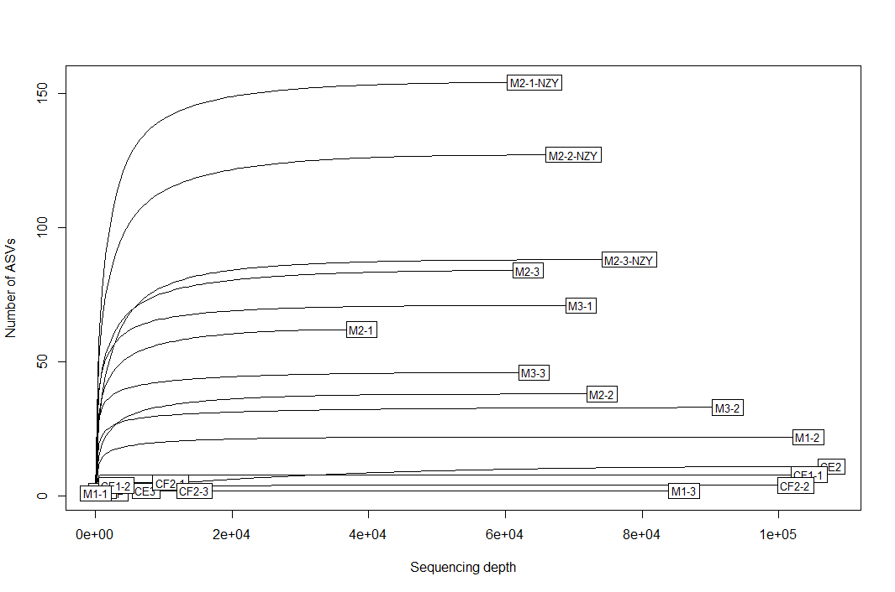
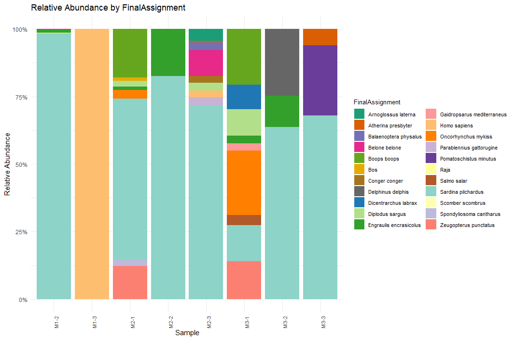

<!-- badges: start -->

[](http://perso.crans.org/besson/LICENSE.html)
[](https://lifecycle.r-lib.org/articles/stages.html#experimental)

<!-- badges: end -->

# Introduction

The Marine Vertebrate eDNA Metabarcoding bioinformatic pipeline (MVeM)
is a comprehensive analysis workflow for high-throughput metabarcoding
data, designed to detect marine vertebrate species, particularly teleost
fish, elasmobranchs, and cetaceans, in environmental DNA samples. The
pipeline aims to support the growing efforts to improve the reliability,
reproducibility, and accessibility of eDNA methods. The pipeline is
further described in Afonso and Álvarez-González et al. (in
peer-review).

# How to cite

If you used MVeM, please cite our work as:
 - Afonso, L., Álvarez-González, M., Pascoal, F. Saavedra, C., Pierce,
    G., Correia, A.M., Magalhães, C., Suarez-Bregua, P. (in peer-review).
    Evaluating Molecular Monitoring Techniques: eDNA Methods and
    Metabarcoding to Detect Marine Vertebrates.

# Preliminary steps

Before starting, we advise the user to create a dedicated directory
(folder) to the project. Within this directory, the user may add
additional directories:

-   R (for R scripts)
-   refs (for reference files)
-   input (for input files, like fastq)
-   results (to store results)

Note: be careful to know the paths to the files you will be using later
on.

## Verify sequencing quality

To verify the quality of the sequencing results, there are several tools
available.

We recommend using either FASTQC (Andrews, 2010) or MultiQC (Ewels,
2016).

-   FASTQC: <https://www.bioinformatics.babraham.ac.uk/projects/fastqc/>
-   MultiQC: <https://seqera.io/multiqc/>

## Pre-processing of FASTQ files

If the FASTQ files include adapter sequences and/or primers, it is
possible to remove them using Cutadapt (Martin, 2011):

-   Cutadapt: <https://cutadapt.readthedocs.io/en/stable/>

``` bash
for r1 in *_R1_*.fastq.gz; do
    r2=${r1/_R1_/_R2_}
    cutadapt \
	-a "AGACGAGAAGACCCTATG;e=0.15;o=5...GGGATAACAGCGCAATCC;e=0.15;o=5" \
	-A "GGATTGCGCTGTTATCCC;e=0.15;o=5...CATAGGGTCTTCTCGTCT;e=0.15;o=5" \
	-q 20 \
	-o Trimmed/${r1} \
	-p Trimmed/${r2} ${r1} ${r2}
done
```
**Note:** change the file paths and primer sequences as needed.

Primer removal is also possible in the DADA2 section of code, presented
below. However, **if you remove the primers with Cutadapt, then you must
not cut them again in DADA2**.

# Raw reads processing in R

Packages required for steps in R:

``` r
# Packages used
library(dada2); packageVersion("dada2") ## we used 1.22
library(ShortRead)
library(seqinr) # to make FASTA file
library(dplyr)
library(ggplot2)
library(stringr)
library(vegan)
```

# Obtain unique sequences using DADA2

DADA2 is an R package used to assign amplicon sequence variants (ASVs)
from FASTQ files (Callahan et al., 2016).

## Data preparation

The first few steps will ensure that DADA2 knows where the FASTQ files
are stored and what they refer to. Note that you will need to change the
path according to your own files.

``` r
path <- "./path_to_directory" # CHANGE ME to the directory containing the fastq files after unzipping (and after Cutadapt trimming if applied).
# Verify files in path
list.files(path)

# Forward and reverse fastq file names have format: SAMPLENAME_R1_001.fastq and SAMPLENAME_R2_001.fastq
# CHANGE according to your file names
# note: fastq.gz files usually don't need to be decompressed for this step
fnFs <- sort(list.files(path, pattern = "_R1_001.fastq", full.names = TRUE))
fnFs
fnRs <- sort(list.files(path, pattern = "_R2_001.fastq", full.names = TRUE))
fnRs

# Extract sample names, assuming filenames have format: SAMPLENAME_XXX.fastq
sample.namesF <- sapply(strsplit(basename(fnFs), "[.]"), `[`, 1)
sample.namesF
sample.namesR <- sapply(strsplit(basename(fnRs), "[.]"), `[`, 1)
sample.namesR

# Place filtered files in filtered/ subdirectory
filtFs <- file.path(path, "filtered", paste0(sample.namesF, "_F_filt.fastq.gz"))
filtRs <- file.path(path, "filtered", paste0(sample.namesR, "_R_filt.fastq.gz"))
names(filtFs) <- sample.namesF
names(filtRs) <- sample.namesR
```

## Quality profiles

Inspect quality of sequencing.

``` r
# Example for 5 samples
# Quality of forward reads
plotQualityProfile(fnFs[1:5])
# Quality of reverse reads
plotQualityProfile(fnRs[1:5])
```

<figure>

<figcaption aria-hidden="true">Quality profiles of forward reads - 5
files</figcaption>
</figure>

<figure>

<figcaption aria-hidden="true">Quality profiles of reverse reads - 5
files</figcaption>
</figure>

You can also visualize aggregate quality plots, recommended for large sample sets. You can save the plot in the results folder for later use.

``` r
# To inspect many samples at once
QProfile_Fw <- plotQualityProfile(fnFs, aggregate = TRUE)
QProfile_Fw
ggsave("./results/QProfile_Fw.tiff", 
       plot = QProfile_Fw, 
       width = 15, 
       height = 12, 
       dpi = 600)

QProfile_Rv <- plotQualityProfile(fnRs, aggregate = TRUE)
QProfile_Rv
ggsave("./results/QProfile_Rv.tiff", 
       plot = QProfile_Rv, 
       width = 15, 
       height = 12, 
       dpi = 600)
```

<figure>

<figcaption aria-hidden="true">Aggregate quality plot example for
forward reads</figcaption>
</figure>

<figure>

<figcaption aria-hidden="true">Aggregate quality plot example for
reverse reads</figcaption>
</figure>


## Filter and trim reads

Based on quality profiles, decide the trimming parameters. Specifically,
`truncLen` is used to trim reads by removing nucleotides at the end of
the reads. In `truncLen`, the first value corresponds to the trimming of
the forward reads and the second is for the reverse reads. While
deciding the trimming, take into account the expected read length of
forward and reverse reads, which need, at least, 12 bp to merge at a
later step. For more details on DADA2 parameters see:
<https://benjjneb.github.io/dada2/tutorial.html>

If the primers are present in your samples and you are sure that they
are right at the beginning of the sequence, then you can use `trimLeft`
to remove them.

All other parameters are set to default.

**Note:** If you are using a Windows OS, set multithread to FALSE.

``` r
out <- filterAndTrim(fnFs, filtFs, fnRs, filtRs, 
                     truncLen = c(170,150), ## change according to quality profiles 
                     maxN = 0, maxEE = c(2,2), truncQ = 2, rm.phix = TRUE, 
                     compress = TRUE, multithread = FALSE, # On Windows set multithread=FALSE
                     ## OPTIONAL: if you need to remove primers at this stage, you can use trimLeft
                     #trimLeft = c(nchar("AGACGAGAAGACCCTATG"),                      
                     #            nchar("GGATTGCGCTGTTATCCC"))
                     ) 
```

## Learn error rates

To distinguish true sequence variations from sequencing errors, DADA2
calculates the probability of finding an error, given the error
distribution. So, the next step is to learn the error rates:

**Note:** This step might take a while. Again, set multithread to FALSE
if using Windows OS.

``` r
# Learn the Error Rates
errF <- learnErrors(filtFs, multithread = FALSE)
errR <- learnErrors(filtRs, multithread = FALSE)
```

After learning the error rates, it is possible to do a sanity check on
the model:

``` r
plotErrors(errF, nominalQ = TRUE)
plotErrors(errR, nominalQ = TRUE)
```

## Dereplication and inference of ASVs

To reduce computational effort, the user may add a dereplication step:

``` r
derepFs <- derepFastq(filtFs, verbose = TRUE)
names(derepFs) <- sample.namesF
derepRs <- derepFastq(filtRs, verbose = TRUE)
names(derepRs) <- sample.namesR
```

Based on error rates model, DADA will identify unique sequences:

``` r
# Identify unique sequences
dadaFs <- dada(derepFs, err = errF, multithread = FALSE)
dadaRs <- dada(derepRs, err = errR, multithread = FALSE)
```

Next, DADA2 will merge the forward and reverse reads. If after this step
you lost a significant amount of reads, check the trimming parameters
(see *Filter and trim reads* section). Consider that you need at least
12 bp of merge between forward and reverse reads (by default). We do not
recommend changing the default overlap.

``` r
# Merge paired reads
mergers <- mergePairs(dadaFs, filtFs, dadaRs, filtRs, verbose = TRUE)
```

Construct an abundance table:

``` r
# Construct sequence table
seqtab <- makeSequenceTable(mergers)
```

Verify length of reads:

``` r
table(nchar(getSequences(seqtab)))
hist(nchar(getSequences(seqtab)), main = "Distribution of Sequence lengths")
```

## Remove chimeric sequences

To remove chimeric sequences:

``` r
# Remove chimeras
seqtab.nochim <- removeBimeraDenovo(seqtab, method = "consensus", multithread = FALSE, verbose = TRUE)

# Check percentage of non-chimeric sequences
sum(seqtab.nochim)/sum(seqtab)
```

## Summary track reads

Then we can track the number of reads after each step:

``` r
# Track reads through the pipeline
getN <- function(x) sum(getUniques(x))
track <- cbind(out, sapply(dadaFs, getN), sapply(dadaRs, getN), sapply(mergers, getN), rowSums(seqtab.nochim))
# If processing a single sample, remove the sapply calls: e.g. replace sapply(dadaFs, getN) with getN(dadaFs)

colnames(track) <- c("Input reads", "Filtered reads", "Denoised Fw reads", "Denoised Rv reads", "Merged reads", "Non-chimeric reads")
rownames(track) <- sample.namesF ## sample.namesF is just to indicate the sample ID
rownames(track) <- gsub("-16S_S1_L001_R1_001", "", rownames(track)) # Change according to your sample names
head(track)

# Save summary table
write.csv(track, file = './results/Summary_table.csv')
```

## Save ASV table

At this stage, you can save the ASV table for later use:

``` r
# Change object name
ASV_table <- seqtab.nochim

# Create .csv file
write.table(ASV_table, file='./results/ASV_table.tsv', quote = FALSE, sep = '\t', col.names = NA)
```

## Rarefaction curves

After saving the ASV table, you can assess sequencing depth across samples by generating rarefaction curves.

``` r
# Load ASV table (from DADA2 output)
# The ASV.table is a TSV file where samples are rows and ASV sequences are columns
ASV_rarefaction <- read.delim("./results/ASV_table.tsv", header = TRUE, row.names = 1, sep = "\t", check.names = FALSE)

# Replace NA's with 0
ASV_rarefaction[is.na(ASV_rarefaction)] <- 0

# Ensure all entries are numeric (in case they were read as characters)
ASV_rarefaction <- apply(ASV_rarefaction, 2, as.numeric)
rownames(ASV_rarefaction) <- rownames(read.delim("./results/ASV_table.tsv", header = TRUE, sep = "\t", check.names = FALSE, row.names = 1))

# Replace sample names to shorter version
rownames(ASV_rarefaction) <- str_remove(rownames(ASV_rarefaction), "-16S_S1_L001_R1_001")

# Rarefaction curve
rarecurve(
  ASV_rarefaction,
  step = 500,
  xlab = "Sequencing depth",
  ylab = "Number of ASVs"
)
```

<figure>

<figcaption aria-hidden="true">Rarefaction curve example</figcaption>
</figure>

## Export reads to a FASTA file

Generally, it is useful to have the final unique sequences in a FASTA
file. We are going to use this file later for BLASTN.

In this step, it is important to keep track of the position of the ASVs,
so that we can connect the taxonomy obtained with NCBI and the abundance
table.

``` r
# Load ASV table
# ASV_table <- read.table("./results/ASV_table.tsv") ## optional: to load the abundance table previously made

# Make data frame with unique ASVs ID and Sequence
ASVs.df <- ASV_table %>% 
    colnames() %>% 
    as.data.frame() %>% 
    rename(Sequence = ".") %>% 
    distinct() %>% 
    {n <- nrow(.)
    mutate(., ASV = paste0("ASV_", sprintf(paste0("%0", nchar(n), "d"), row_number()))) 
    } %>%
    arrange(ASV)

# Make FASTA file 
write.fasta(sequences = as.list(ASVs.df$Sequence), 
            names = ASVs.df$ASV, 
            "./results/ASV.fasta",
            as.string = TRUE)
```

# Assign taxonomy

To assign taxonomy, we follow these steps:

1.  BLASTN against the nucleotide (nt) database from NCBI
    (<https://ftp.ncbi.nlm.nih.gov/blast/db/>).
2.  Filter the best hits based on multiple parameters (see below).
3.  Solve ties within genus and family level (Lowest Common Ancestor
    approach).

## Run BLASTN against NCBI

To run blastn (Camacha et al., 2009; Altschul et al., 1990) against the
nucleotide database of NCBI (Benson et al., 2013), we use the **BLAST
Command Line Tool**.

Please see installation instructions at:
<https://www.ncbi.nlm.nih.gov/books/NBK569861/>

Blast parameters: 
- Minimum percentage identity: 99.0%
- Maximum evalue: 10⁻⁵
- Minimum query cover: 80%

**Note**: Don’t forget to change the path and file names.

``` bash
blastn -db nt -query ./results/ASV.fasta -out blast_results -outfmt "6 qacc qlen sseqid sacc slen evalue bitscore score length pident nident mismatch positive gaps staxid ssciname sblastname scomnames skingdoms" -evalue 1e-05 -perc_identity 99 -qcov_hsp_perc 80 -remote
```

This command returns a table named blast_results (you can change the
name as needed). The parameter *-outfmt* determines the format and
variables present in the table.

The parameter *-remote* runs the code in the NCBI dedicated server,
which means that the time it takes to run your samples might vary.

**Note:** change the file paths as needed.

## Retrieve full taxonomic information

The BLAST results do not provide the complete taxonomy for each hit. 
However, there are several options for obtaining the full taxonomic information.
In this pipeline, we use the **NCBI Taxonomy Toolkit - TaxonKit** (Shen & Ren, 2021).

Please see installation instructions at:
<https://bioinf.shenwei.me/taxonkit/download/#download>

This tool allows the submission of BLAST output as input, using NCBI taxon IDs to retrieve taxonomy information.

``` bash
cat blast_results | taxonkit reformat2 -I 15 -r "Unassigned" -f "{domain|acellular root|superkingdom}\t{phylum}\t{class}\t{order}\t{family}\t{genus}\t{species}" | tee blast_tax_results
```
**Note:** change the file paths as needed.

Other options that can be used for obtaining the full taxonomy include the R package *taxonomizr* or the R package *worrms*. 
For the latter, the user should note that this tool uses the scientific name instead of the taxon ID to retrieve tha accepted taxonomy from WoRMS, which may require some data cleaning before application.

## Assign taxonomy based on best hits

For this section we will need additional packages:

``` r
library(tidyr)
library(ulrb)
library(purrr)
```

The raw blast results include all the hits. Therefore, we need to apply
multiple filters to obtain the best hits. To do so, we go back to R.

Start by loading the blast results into your R session:

``` r
# Load blast results
all_hits <- read.table("./results/blast_tax_results", header = FALSE, sep = "\t", # change file path as needed
                     col.names = c("Query accession", "Query sequence length",
                                   "Subject seq-id",    "Subject accession",
                                   "Subject sequence length",   "evalue", "Bit Score",
                                   "Raw Score", "Alignment length", "Percentage of identical matches",
                                   "Number of identical matches",   "Number of mismatches",
                                   "Number of positive scoring matches", "Total number of gaps",
                                   "Taxonomy ID", "Scientific name",    "Subject blast name", "Subject common name",
                                   "Domain", "Phylum", "Class", "Order", "Family", "Genus", "Species"))
```

## Add ban list (optional)

Considering the length of the reads used to classify taxonomy, and
considering the high similarity between some species within the same
families, it is possible to have a sequence attributed to multiple
different species. However, based on the study area, it might be
possible to know beforehand that some species are not present in the
area. Thus, in those specific situations, to improve the accuracy of the
classification, we can remove them, using a ban list. Note that this is
optional and should be carefully considered by the user, to avoid
introducing bias in the analysis.

If you want to apply a ban list, you must edit the file
**ban_list.txt**, according to your own experimental setup. If you have
no prior knowledge of the species expected in the area, then you should
**not** apply this step.

``` r
# Ban list
ban_list <- read.table("./refs/ban_list.txt", header = FALSE) %>% 
  rename(Genus = V1,
         Species = V2) %>% 
  mutate(binomial_name = paste(Genus, Species)) %>% 
  pull(binomial_name)
```

## Prevent match with non-16S genes

Additionally, we also need to ensure that we are not obtaining matches
from non-mitochondrial genes. To do so, we filter all accessions based on a
reference file with all possible target gene accessions.

``` r
# Target genes
target_genes <- read.table("refs/accession_mitochondrial_list.txt", header = TRUE) ## last accessed 16 Oct 2025
```

Filter relevant hits:

-   Minimum alignment length: 190 nt
-   Remove species in ban list
-   Remove hits from non-target genes

``` r
# Filter valid hits
filtered_hits <- all_hits %>%
  filter(Alignment.length >= 190,
         !Scientific.name %in% ban_list,
         Subject.accession %in% target_genes$Subject.accession,
         # Remove environmental sample rows
         !grepl("environmental sample", Species, ignore.case = TRUE)) %>%
         # Normalize to first two words for species-level matching
         mutate(Scientific.name = sub("^([A-Za-z]+\\s+[A-Za-z]+).*", "\\1", Species))
```

After filtration, we have multiple hits for each ASV. To obtain the best
hit, we select the hits with highest bit score and percentage identity:

``` r
# Obtain top hits and remove environmental samples hits before summarizing
top_hits <- filtered_hits %>%
  group_by(Query.accession) %>%
  filter(Bit.Score == max(Bit.Score)) %>%
  filter(Percentage.of.identical.matches == max(Percentage.of.identical.matches)) %>% 
  ungroup()
```

## Solve ties by LCA approach

It is possible to obtain multiple hits with the same scores, but
different species. Usually, within the same genus or within the same
family. We call these situations *ties*.

To solve ties we need the following functions:

-   check_ties; *identifies ties that need to be solved*
-   assign_LCA. *breaks the tie by identifying the lowest common ancestor - LCA*

``` r
# Check ties function
check_ties <- function(x){
  x %>%
    pull(Species) %>% 
    unique() %>% 
    word() %>%
    unique() 
} 
```

``` r
# assign_LCA function
assign_LCA <- function(x){
  # make possible LCAs
  dom_LCA <- x %>% pull(Domain) %>% unique()
  phyl_LCA <- x %>%  pull(Phylum) %>% unique()
  class_LCA <- x %>% pull(Class) %>% unique()
  ord_LCA <- x %>%  pull(Order) %>% unique()
  fam_LCA <- x %>% pull(Family) %>% unique()
  genus_LCA <- x %>%  pull(Genus) %>% unique()
  species_LCA <- x %>%pull(Species) %>% unique()
    taxonomic_levels <- c("Domain", "Phylum", "Class", "Order", "Family", "Genus", "Species")
  #
  if(length(dom_LCA) > 1){
    LCA <- "Uncertain"
    Level <- taxonomic_levels
  } else if(length(phyl_LCA) > 1){
    LCA <- dom_LCA
    Level <- taxonomic_levels[2:7]
  } else if(length(class_LCA) > 1){
    LCA <- phyl_LCA
    Level <- taxonomic_levels[3:7]
  } else if(length(ord_LCA) > 1){
    LCA <- class_LCA
    Level <- taxonomic_levels[4:7]
  } else if(length(fam_LCA) > 1){
    LCA <- ord_LCA
    Level <- taxonomic_levels[5:7]
  } else if(length(genus_LCA) > 1){
    LCA <- fam_LCA
    Level <- taxonomic_levels[6:7]
  } else if(length(species_LCA) > 1){
    LCA <- paste(genus_LCA, "sp.")
    Level <- taxonomic_levels[7]
  } else {
    LCA <- species_LCA
    Level <- NA
  }
  return(c(LCA, Level))
}
```

**Note on assign_LCA():** - For species tied within the same genus, we
can always assign LCA - it is the genus sp. - Likewise, we can break
ties up to family level (that is, assign LCA up to order level). - Note:
if genera from different orders are tied, we assign to **Uncertain**.

Get best hits, without ties:

``` r
# Best hits, with LCA
taxonomic_assignments <- top_hits %>%
  group_by(Query.accession) %>% 
  nest() %>% 
  mutate(LCA = map(.x = data, 
                   .f = ~assign_LCA(.x)[1])) %>% 
  mutate(taxa = map(.x = data, .f = ~unique(.x$Species))) %>% 
  mutate(isTie = map(.x = taxa, .f = ~ifelse(length(unique(.x)) == 1, FALSE, TRUE))) %>%
  mutate(Level = map(.x = data, 
                     .f = ~assign_LCA(.x)[-1])) %>% 
  unnest(c(LCA, data, isTie)) %>% 
  group_by(Query.accession) %>% 
  slice_head(n = 1) %>% 
  mutate(FinalAssignment = ifelse(isTRUE(isTie), LCA, Species)) %>% 
  mutate(Species = ifelse(!is.na(Level), NA, Species)) %>% 
  mutate(Genus = case_when("Genus" %in% Level[[1]] ~ NA, TRUE ~ Genus)) %>% 
  mutate(Family = case_when("Family" %in% Level[[1]] ~ NA, TRUE ~ Family)) %>% 
  mutate(Order = case_when("Order" %in% Level[[1]] ~ NA, TRUE ~ Order)) %>% 
  mutate(Class = case_when("Class" %in% Level[[1]] ~ NA, TRUE ~ Class)) %>% 
  mutate(Phylum = case_when("Phylum" %in% Level[[1]] ~ NA, TRUE ~ Phylum)) %>% 
  select(Query.accession,
         FinalAssignment, 
         Bit.Score, evalue, Alignment.length,
         Percentage.of.identical.matches,
         Number.of.identical.matches,
         Number.of.mismatches,
         Domain, Phylum, Class,
         Order, Family, Genus,
         Species)

tax_assign_merged <- taxonomic_assignments %>% 
  select(ASV = Query.accession,
         FinalAssignment, 
         Bit.Score, evalue, Alignment.length,
         Percentage.of.identical.matches,
         Number.of.identical.matches,
         Number.of.mismatches,
         Domain, Phylum, Class,
         Order, Family, Genus,
         Species) %>% 
  filter(!is.na(FinalAssignment)) %>%  # Remove unassigned ASVs
  left_join(ASVs.df, by = "ASV") # ASVs.df was made in the DADA2 section

# View results in your R session
View(tax_assign_merged)

# Save taxonomic assignments into memory
write.csv(tax_assign_merged, "results/taxonomic_assignments.csv", row.names = FALSE)
```

After taxonomic assignment, we can filter our ASVs by target biological groups (actinopterygians, mammals, and elasmobranchs)

``` r
filt_tax_assignments <- tax_assign_merged %>%
  filter(Class %in% c("Mammalia", "Actinopteri", "Chondrichthyes"))

# Save final taxonomic assignments into memory
write.csv(filt_tax_assignments, "results/taxonomic_assignments_filtered.csv", row.names = FALSE)
```

## Add taxonomic assignments to ASV abundance table

First, we need to transform the blast results in a data frame compatible
with the abundance table. Then, we can merge them based on ASV ID.

``` r
# Create abundance table in long format
abundance_table_long <- ASV_table %>% # ASV_table was made in DADA2 section
  prepare_tidy_data(sample_names = row.names(ASV_table), samples_in = "rows") %>% 
  rename(Sequence = Taxa_id) %>% 
  left_join(ASVs.df, by = "Sequence") %>% 
  left_join(filt_tax_assignments, by = "ASV")

# Creates abundance table in wide format
abundance_table_wide <- abundance_table_long %>% 
  filter(!is.na(FinalAssignment)) %>%
  pivot_wider(names_from = Sample, values_from = Abundance)

table_1 <- abundance_table_wide %>%
  select(ASV, FinalAssignment,
         18:last_col(),
         Domain, Phylum, Class, Order, Family, Genus, Species) %>%
  arrange(ASV)
colnames(table_1) <- gsub("-16S_S1_L001_R1_001", "", colnames(table_1))

# Save wide format abundance table
write.csv(table_1, "results/Table_1.csv", row.names = FALSE)
```

## Filter ASVs by abundance and presence in negative controls

After the abundance table is ready, we can add additional steps, like
the removal of ASVs below 0.01% relative abundance.

``` r
# Filter local low abundance (< 0.01%)
abundance_table_long_filtered <- abundance_table_long %>% 
  group_by(Sample) %>% 
  mutate(relativeAbundance = Abundance*100/sum(Abundance)) %>% 
  mutate(Abundance = ifelse(Abundance == 1, 0, Abundance),
         Abundance = ifelse(relativeAbundance > 0.01, Abundance, 0),
         Abundance = ifelse(is.na(Abundance), 0, Abundance)) %>% 
  select(-Sequence.y, -relativeAbundance) %>% 
  rename(Sequence = Sequence.x)
```

**Identify ASVs from control samples and filter them out**

Before this step, fill the **sample_control_map_template.xlsx** file in
**refs** folder, indicating the associated negative controls for each sample. You can follow the example file,
**sample_control_map_example.xlsx**.

``` r
# Load sample_control_map
sample_control_map_df <- readxl::read_xlsx("refs/sample_control_map_example_complete.xlsx")

# Convert to long format 
sample_control_map_long <- sample_control_map_df %>% 
  pivot_longer(cols = c("Extraction_control", 
                        "Filtration_control", 
                        "PCR_control"),
               values_to = "Control_ID",
               names_to = "Control_type")

# Load function to remove contamination, based on control map
source("./R/remove_contamination.R")

# Store sample names in a vector
sample_names <- sample_control_map_df$Sample_name %>% unique() 

# Remove contamination for all samples and re-merge in a single data frame
abundance_table_no_cont <- map(.x = sample_names, 
                               .f = ~remove_contamination(data = abundance_table_long_filtered,
                                                          sample = .x)) %>% 
  bind_rows()

# To obtain a list of the ASVs that were considered contaminants in each sample
list_of_contaminants <- map(.x = sample_names, 
                            .f = ~remove_contamination(data = abundance_table_long_filtered,
                                                       sample = .x, 
                                                       output = "contaminants")) %>% 
  bind_rows()
```

### Additional options for removal of contaminant ASVs

It is possible that some ASVs that are identified in the control samples do not need to
be removed from the environmental samples, if they have high abundance in the environmental samples.

Therefore, some researchers might apply an abundance threshold to prevent some ASVs from being removed.
This can be done by setting the arguments *threshold* and *option* in remove_contamination() function:

``` r
# Example with threshold of 1000 reads, per sample
example_1000 <- map(.x = sample_names, 
                    .f = ~remove_contamination(data = abundance_table_long_filtered, 
                                               sample = .x, 
                                               threshold = 1000, 
                                               option = "threshold",
                                               output = "standard")) %>% 
  bind_rows()

# If you wanto to verify which ASVs were considered contaminants with a threshold of 1000 reads
contaminants_1000 <- map(.x = sample_names, 
                    .f = ~remove_contamination(data = abundance_table_long_filtered, 
                                               sample = .x,
                                               threshold = 1000, 
                                               option = "threshold",
                                               output = "contaminants")) %>% 
  bind_rows()
```

However, the threshold approach implies that a researcher 
pre-selects an abundance level, which will then be applied for all samples.

To avoid potential bias in the selection of which ASVs to consider 
contaminants or not, we have added an automatic option.
The automatic option uses unsupervised learning to classify ASVs within each environmental sample 
based on their abundance level, using the ulrb R package (Pascoal et al., 2025a,b). By doing so, the function is 
able to automatically select which ASVs are considered abundant enough to not be removed 
from the environmental samples. The main advantage of the automatic option is that the
evaluation of ASVs in one sample is not influenced by the results obtained in another sample, 
which then prevents issues with uneven sequencing depth across samples.

To apply the automatic option:

``` r
# Example without threshold
example_automatic <- map(.x = sample_names, 
                    .f = ~remove_contamination(data = abundance_table_long_filtered, 
                                               sample = .x, 
                                               output = "standard",
                                               option = "automatic")) %>% 
  bind_rows()

# If you want to verify which ASVs were considered contaminants without thresholds
contaminants_automatic <- map(.x = sample_names,
                              .f = ~remove_contamination(data = abundance_table_long_filtered,
                                                         sample = .x,
                                                         option = "automatic",
                                                         output = "contaminants")) %>% 
  bind_rows()

# If you want to verify which ASVs were saved
saved_automatic <- map(.x = sample_names,
                        .f = ~remove_contamination(data = abundance_table_long_filtered,
                                                         sample = .x,
                                                         option = "automatic",
                                                         output = "saved")) %>% 
  bind_rows()
```

**Save new results**

The next steps show how the results after contamination removal can be stored, using 
the original process, *i.e.*, without preventing abundant ASVs from being removed.

``` r
# Convert to wide format
abundance_table_no_cont_wide <- abundance_table_no_cont %>% 
  pivot_wider(names_from = Sample, values_from = Abundance)

table_2 <- abundance_table_no_cont_wide %>%
  select(ASV, FinalAssignment,
         17:last_col(),
         Domain, Phylum, Class, Order, Family, Genus, Species) %>%
  filter(!is.na(FinalAssignment)) %>% 
  mutate(across(where(is.numeric), ~replace_na(.x, 0))) %>%
  arrange(ASV)
colnames(table_2) <- gsub("-16S_S1_L001_R1_001", "", colnames(table_2))

# Save the output table
write.csv(table_2, file = "results/Table_2.csv", row.names = FALSE)
```

# Verify results

For this section we need additional packages:

``` r
library(vegan)
library(scales)
library(ggplot2)
```

We provide some examples of data analyses below, namely visualization of alpha and beta diversity across your data, and originating reads' relative abundance plots for all taxonomic levels.


## Example of quick diversity analysis

``` r
#Load Table 2
#diversity_plot_matrix <- read.csv("/Table_2.csv")
diversity_plot_matrix <- table_2 

# Define and remove unwanted columns
cols_to_remove <- c("FinalAssignment", "Domain", "Phylum", "Class", "Order", "Family", "Genus", "Species")

# Make a shorter table
df_clean <- diversity_plot_matrix  %>% 
  select(-any_of(cols_to_remove))

# Create ASV matrix
# Ensure unique rownames (from first column, presumably ASV IDs)
rownames(df_clean) <- make.unique(as.character(df_clean[[1]]))

# Extract abundance matrix (drop first column which was used as rownames)
asv_matrix_alpha <- df_clean[, -1]

# Clean sample names by removing suffix
colnames(asv_matrix_alpha) <- gsub("-16S_S1_L001_R1_001", "", colnames(asv_matrix_alpha))

# Transpose: samples as rows, ASVs as columns
asv_matrix_alpha_t <- t(asv_matrix_alpha)

# Remove empty samples (rows with sum 0)
asv_matrix_alpha_t <- asv_matrix_alpha_t[rowSums(asv_matrix_alpha_t) > 0, ]

# Clean sample names again from filtered matrix rownames (just to be sure)
rownames(asv_matrix_alpha_t) <- gsub("-16S_S1_L001_R1_001", "", rownames(asv_matrix_alpha_t))

# Alpha Diversity per Sample (Observed + Shannon)
# Calculate diversity metrics per sample
alpha_df <- data.frame(
  Sample = rownames(asv_matrix_alpha_t),
  Observed = rowSums(asv_matrix_alpha_t > 0),
  Shannon = diversity(asv_matrix_alpha_t, index = "shannon")
)

# tidy alpha_df
alpha_tidy <- alpha_df %>% 
  pivot_longer(cols = c("Observed", "Shannon"), 
               names_to = "Metric", 
               values_to = "Score")

# Observed Richness (Boxplot only)
ggplot(alpha_tidy, aes(y = Score)) +
  geom_boxplot(fill = "steelblue", alpha = 0.8) +
  labs(title = "Alpha diversity", 
       x = "", 
       y = "") +
  facet_wrap(~Metric, scales = "free_y")
```

<figure>

<figcaption aria-hidden="true">Alpha diversity - boxplot
example</figcaption>
</figure>

``` r
# Beta Diversity (Bray-Curtis)
# Calculate Bray-Curtis dissimilarity
bray_dist <- vegdist(asv_matrix_alpha_t, method = "bray")

# Perform NMDS (k=2 dimensions)
set.seed(42); nmds_res <- metaMDS(bray_dist, k = 2, trymax = 100)

# Extract NMDS points
nmds_df <- as.data.frame(nmds_res$points)
colnames(nmds_df) <- c("NMDS1", "NMDS2")

# Add sample names
nmds_df$Sample <- rownames(asv_matrix_alpha_t)

# Print NMDS stress value
cat("NMDS stress:", round(nmds_res$stress, 4), "\n")

# Plot NMDS
ggplot(nmds_df, aes(x = NMDS1, y = NMDS2, label = Sample)) +
  geom_point(size = 3, color = "darkorange") +
  geom_text(vjust = -0.5, size = 3) +
  labs(title = paste("Beta Diversity (Bray-Curtis NMDS), Stress =", round(nmds_res$stress, 3)),
       x = "NMDS1", y = "NMDS2") +
  theme_minimal()


# Relative Abundance Plot
# Start fresh from Table_2
# Remove ASV column only
df_relativeabundance <- table_2 %>% select(-ASV)

# Define taxonomic levels to plot
tax_levels <- c("Domain", "Phylum", "Class", "Order", "Genus", "Species", "FinalAssignment")

# Define custom color palette (30 colors)
custom_colors <- c(
  "#1b9e77", "#d95f02", "#7570b3", "#e7298a", "#66a61e",
  "#e6ab02", "#a6761d", "#666666", "#1f78b4", "#b2df8a",
  "#33a02c", "#fb9a99", "#fdbf6f", "#ff7f00", "#cab2d6",
  "#6a3d9a", "#ffff99", "#b15928", "#8dd3c7", "#ffffb3",
  "#bebada", "#fb8072", "#80b1d3", "#fdb462", "#b3de69",
  "#fccde5", "#d9d9d9", "#bc80bd", "#ccebc5", "#ffed6f"
)

# Loop through each taxonomic level to create relative abundance plots
for (tax in tax_levels) {
  
  # Remove rows with NA in the current taxonomic level
  df_tax <- df_relativeabundance %>%
    filter(!is.na(.data[[tax]])) %>%  # <-- added line
  
  # Aggregate counts at the taxonomic level
    group_by(across(all_of(tax))) %>%
    summarise(across(where(is.numeric), sum), .groups = "drop")
  
  # Pivot to long format
  df_long <- df_tax %>%
    pivot_longer(cols = -all_of(tax), names_to = "Sample", values_to = "Abundance")
  
  # Clean sample names
  df_long$Sample <- gsub("-16S_S1_L001_R1_001", "", df_long$Sample)
  
  # Remove zero abundances
  df_long <- df_long %>% filter(Abundance > 0)
  
  # Calculate relative abundance per sample
  df_rel <- df_long %>%
    group_by(Sample) %>%
    mutate(RelAbund = Abundance / sum(Abundance)) %>%
    ungroup() %>%
    rename(Taxon = all_of(tax))
  
  # Plot stacked bar chart with the same custom colors
  p <- ggplot(df_rel, aes(x = Sample, y = RelAbund, fill = Taxon)) +
    geom_bar(stat = "identity") +
    labs(
      title = paste("Relative Abundance by", tax),
      x = "Sample",
      y = "Relative Abundance"
    ) +
    theme_minimal() +
    theme(
      axis.text.x = element_text(angle = 90, hjust = 1, size = 8),
      legend.title = element_text(size = 10),
      legend.text = element_text(size = 8)
    ) +
    scale_y_continuous(labels = percent_format()) +
    scale_fill_manual(values = custom_colors) +
    guides(fill = guide_legend(title = tax))
  
  print(p)
}
```
<figure>

<figcaption aria-hidden="true">Relative Abundance - plot
example</figcaption>
</figure>

# References

-   Afonso, L., Álvarez-González, M., Pascoal, F. Saavedra, C., Pierce,
    G., Correia, A.M., Magalhães, C., Suarez-Bregua, P. (in peer-review).
    Refining Molecular Monitoring Techniques: eDNA Methods and
    Metabarcoding to Detect Marine Vertebrates.

-   Altschul, S.F., Gish, W., Miller, W., Myers, E.W. and Lipman, D.J.
    (1990). Basic local alignment search tool. Journal of Molecular
    Biology, 215(3), pp.403-410.

-   Andrews, S. (2010). FastQC: A Quality Control Tool for High
    Throughput Sequence Data
    *O**n**l**i**n**e*
    . Available online at:
    <http://www.bioinformatics.babraham.ac.uk/projects/fastqc/>

-   Benson, D. A., Cavanaugh, M., Clark, K., Karsch-Mizrachi, I.,
    Lipman, D. J., Ostell, J., & Sayers, E. W. (2013). GenBank. Nucleic
    acids research, 41(D1), D36-D42.

-   Callahan BJ, McMurdie PJ, Rosen MJ, Han AW, Johnson AJ, Holmes SP.
    DADA2: High-resolution sample inference from Illumina amplicon data.

-   Camacho, C., Coulouris, G., Avagyan, V., Ma, N., Papadopoulos, J.,
    Bealer, K., and Madden, T.L. 2009. BLAST+: architecture and
    applications. BMC Bioinformatics, 10, 421.

-   Ewels P, Magnusson M, Lundin S, Käller M. MultiQC: summarize
    analysis results for multiple tools and samples in a single report.
    Bioinformatics. 2016 Oct 1;32(19):3047-8. doi:
    10.1093/bioinformatics/btw354. Epub 2016 Jun 16. PMID: 27312411;
    PMCID: PMC5039924.
    
-   Martin, M., 2011. Cutadapt removes adapter sequences from high-throughput sequencing reads. EMBnet.journal 17, 10–12. https://doi.org/10.14806/ej.17.1.200

-   Shen, W., & Ren, H. (2021). TaxonKit: A practical and efficient NCBI taxonomy toolkit. Journal of genetics and genomics, 48(9), 844-850.
